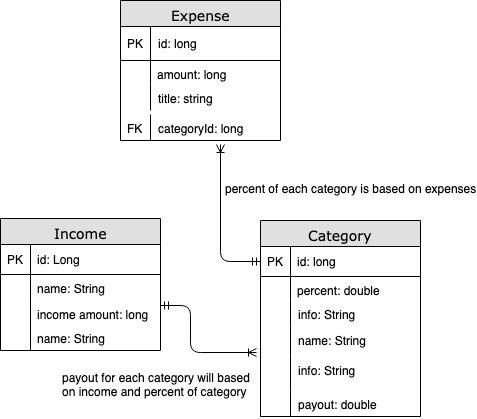

# ERD for Budget Backwards
+ updated July 17, 2019

You are free to examine the ERD below in PNG or PDF format.

Second iteration of the ERD

[ERD #2 in PDF format](budget_erd_1.pdf) 

First iteration of the ERD

[ERD in PDF format](budget_erd_2.pdf) 

+ [Readme](https://treypage.github.io/budget-backwards/)
+ [User stories](user-stories.md)
+ [ERD](ERD.md)
+ [Milestone 2](milestone-2.md)
+ [Data Model](data-model.md)

